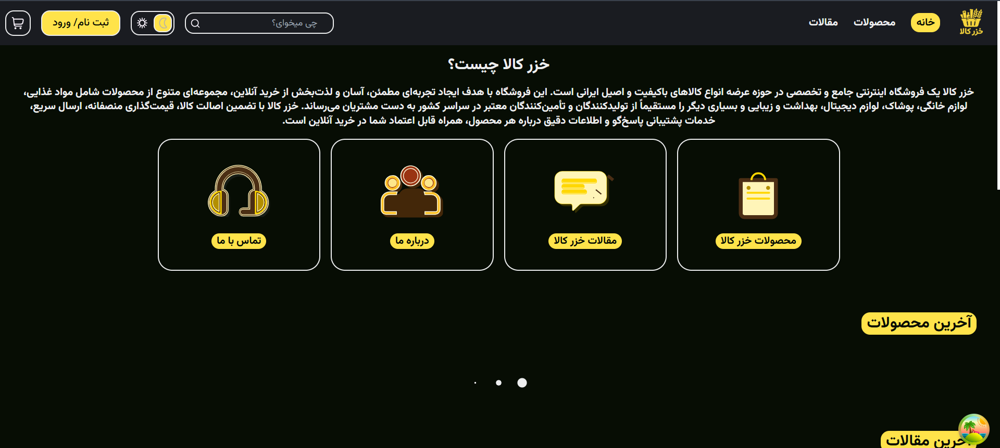
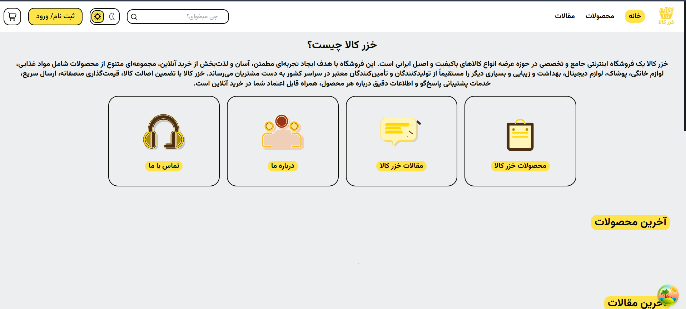

<div align="center">

# 🛒 Khazarkala Shop

### Modern MERN Stack E-Commerce Platform

<p>
  
  
  
  
  
  
</p>

<p>
  Full-featured online store with authentication, product management, payments, notifications, user dashboard, and admin dashboard.
</p>

</div>

---

## ✨ Highlights

* 🔐 JWT Authentication
* 📦 Product Management
* 📱 Fully Responsive Design
* 📧 Email Notifications
* 📲 SMS Verification
* ☁️ Image Uploads with Multer
* 📖 Swagger API Documentation
* ⚡ Optimized with React Query
* 🎯 SEO Friendly

---

## 📸 Preview

<p align="center">
  <picture>
    <!-- Dark Mode -->
    
  </picture>
  <picture>
    <!-- Light Mode -->
    
  </picture>
</p>

---

## 🏗 Tech Stack

| Frontend       | Backend    |
| -------------- | ---------- |
| React          | Node.js    |
| TypeScript     | Express.js |
| Vite           | MongoDB    |
| TailwindCSS    | Mongoose   |
| Redux Toolkit  | JWT        |
| TanStack Query | Nodemailer |
| React Router   | Multer     |

---

## 📂 Project Structure

```text
Khazarkala-Shop
│
├── frontend
│   └── src
│       ├── api
│       ├── components
│       ├── constants
│       ├── hooks
│       ├── pages
│       ├── redux
│       ├── types
│       └── utils
│
├── backend
│   ├── common
│   │   ├── enums
│   │   ├── functions
│   │   └── types
│   │
│   ├── modules
│   │   ├── auth
│   │   ├── blog
│   │   ├── category
│   │   ├── comment
│   │   ├── images
│   │   ├── product
│   │   ├── search
│   │   ├── user
│   │   ├── zarinpal
│   │   └── fileupload.ts
│   │
│   ├── router.routes.ts
│   └── server.ts
```

---

## 🚀 Quick Start

```bash
git clone <repo-url>

cd frontend
npm install
npm run dev

cd ../backend
npm install
npm start
```

---

## 🌟 Features Overview

| Feature           | Status |
| ----------------- | ------ |
| Authentication    | ✅      |
| Product Catalog   | ✅      |
| Shopping Cart     | ✅      |
| SMS Verification  | ✅      |
| Email Service     | ✅      |
| Admin Dashboard   | ✅      |
| API Documentation | ✅      |
